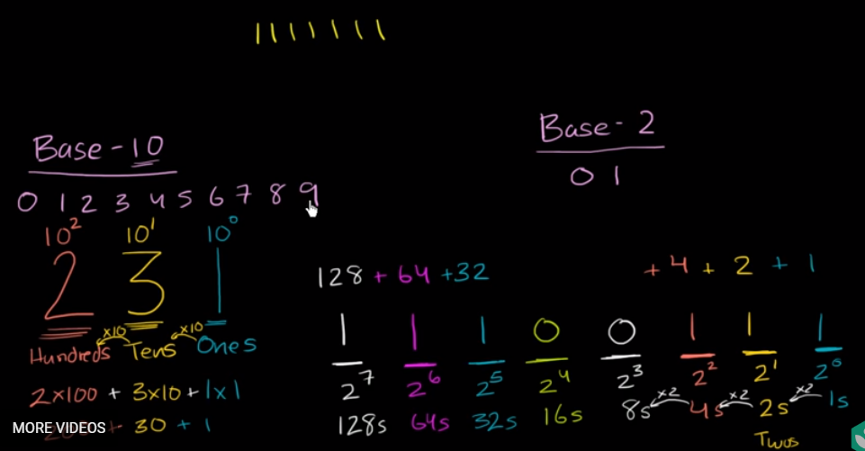
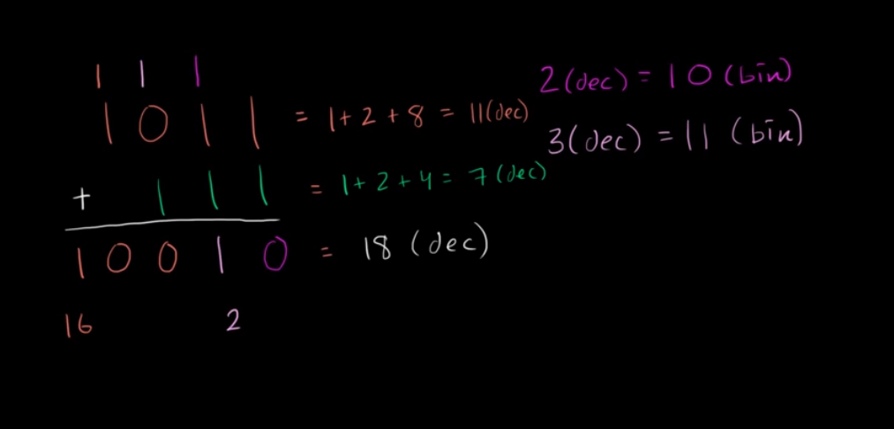
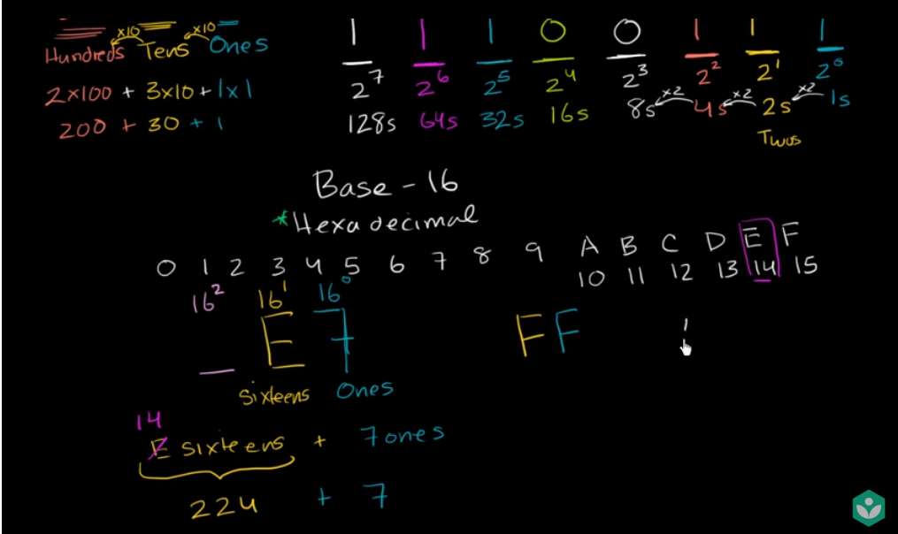

# Week 2

## Overview

### Objectives

By the end of this week, you should be able to:

+ Write simple Python programs
+ Convert back and forth between binary and base10 integers.
+ Be able to add binary numbers.
+ Convert back and forth between hexadecimal and integers.
+ Understand and be able to use RGB colors.

### Readings & Resources

+ All of the readings are in the module for the week. The lectures are interactive, make sure you complete the hands-on exercises inside the lectures.

### Activities & Assignments

1. Self-Paced exercises in PyCharm - The best way to learn is by doing!  In that spirit, this class is designed to give you lots of practice instead of lots of reading.  The self-paced activities are not graded, but don't skip them! They are essential if you are going to be able to complete the assignments.  Each week you will find a discussion forum where you can post questions and insights from these activities. You will find the self-paced programming exercises as part of PyCharm.
2. Complete the discussion started last week, "How high can you count on five fingers?"
3. Programming Project: "Conversation with a computer"
4. Quic on hexadecimal and binary numbers

## Lesson

### Python Introduction

> *"A computer is like a Swiss Army knife that you can configure for countless tasks. Many people spend hours clicking and typing to perform repetitive tasks, unaware that the machine they’re using could do their job in seconds if they gave it the right instructions."*

+ __Programming__ - the act of entering instructions for the computer to perform

### Python Basics

+ __Expression__ - The most basic kind of programming instruction in the language

```python
# A simple expression
2 + 2
```

+ Expressions consis of __values__ (such as `2`) and __operators__ (such as `+`)
+ They can always __evaluate__ (reduce) down to a single value
+ In the previous example `2 + 2` is evaluated down to a single value, `4`

| Operator | Operation                         | Example | Evaluates to... |
| -------- | --------------------------------- | ------- | --------------- |
| `**`     | Exponent                          | `2**3`  | `8`             |
| `%`      | Modulus/remainder                 | `22%8`  | `6`             |
| `//`     | Integer division/floored quotient | `22//8` | `2`             |
| `/`      | Division                          | `22/8`  | `2.75`          |
| `*`      | Multiplication                    | `3*5`   | `15`            |
| `-`      | Subtraction                       | `5-2`   | `3`             |
| `+`      | Addition                          | `2+2`   | `4`             |

__Test Question__:

If today was a Tuesday and you wanted to know what day of the week it would be 100 days from now, which operator would help?

__Answer__:

Finding the remainder is really handy at solving problems like this. `100 % 7 = 2`. So if today was a Tuesday, then 100 days from now would be a Thursday since that is 2 days later in the week than a Tuesday.

__Test Question__:

How many weeks will have passed 100 days from now?

__Answer__:

Integer division can help solve this problem. `100 // 7 = 14`. So 14 full weeks will have passed 100 days from now (plus 2 additional days).

+ The order of operations, called __precedence__ of Python math operators:

1. `**`
2. `*`
3. `/`
4. `//`
5. `%`
6. `+`
7. `-`

```
>>> 2 + 3 * 6
20
>>> (2 + 3) * 6
30
>>> 48565878 * 578453
28093077826734
>>> 2 ** 8
256
>>> 23 / 7
3.2857142857142856
>>> 23 // 7
3
>>> 23 % 7
2
>>> 2     +            2
4
>>> (5 - 1) * ((7 + 1) / (3 - 1))
16.0
```

+ Syntax error - Python can't understand what you're trying to ask it to do

```
>>> 5 +
  File "<stdin>", line 1
    5 +
      ^
SyntaxError: invalid syntax
>>> 42 + 5 + * 2
  File "<stdin>", line 1
    42 + 5 + * 2
             ^
SyntaxError: invalid syntax
```

### The Integer, Floating-Point, and String Data Types

+ A __Data Type__ is a category for values, and every value belongs to exactly one data type

__Common Data Types__

| Data Type              | Examples                             |
| ---------------------- | ------------------------------------ |
| Integers               | `2`,`-1`,`0`,`1`,`2`,`3`,`1042`      |
| Floating-point numbers | `-1.25`,`-1.0`,`0.0`,`0.5`,`1.35442` |
| Strings                | `a`,`aa`,`Hello World!`,`9`          |

+ `SyntaxError: EOL while scanning string literal` often happens when the final single quote character at the end of the string is missing

```
>>> 'Hello world!
SyntaxError: EOL while scanning string literal
```

### String Concatenation and Replication

+ `+` adds to values together if they are `int` or `float`, but it is the __concatenation__ operator

```
>>> 'Alice' + 'Bob'
'AliceBob'
```

```
>>> 'Alice' + 42
Traceback (most recent call last):
  File "<pyshell#26>", line 1, in <module>
    'Alice' + 42
TypeError: Can't convert 'int' object to str implicitly
```

+ `*` is the multiplication operator with `int` or `float`, but with two strings it is a __replication__ operator

```
>>> 'Alice' * 5
'AliceAliceAliceAliceAlice'
```

```
>>> 'Alice' * 'Bob'
Traceback (most recent call last):
  File "<pyshell#32>", line 1, in <module>
    'Alice' * 'Bob'
TypeError: can't multiply sequence by non-int of type 'str'
>>> 'Alice' * 5.0
Traceback (most recent call last):
  File "<pyshell#33>", line 1, in <module>
    'Alice' * 5.0
TypeError: can't multiply sequence by non-int of type 'float'
```

### Storing Values in Variables

+ A __variable__ can store a single value

### Assignment Statements

+ __Assignment Statement__ - stores values in variables
+ `spam = 42` is an assignement statement

```
>>> spam = 40
>>> spam
40
>>> eggs = 2
>>> spam + eggs
42
>>> spam + eggs + spam
82
>>> spam = spam + 2
>>> spam
42
```

+ When a variable is assigned to a new value the variable is __overwritten__

```
>>> spam = 'Hello'
>>> spam
'Hello'
>>> spam = 'Goodbye'
>>> spam
'Goodbye'

```
### Variable Names

+ Variables can be named anything as long as they obey the following rules:

1. It can be only one word.

2. It can use only letters, numbers, and the underscore, `_`, character.

3. It can’t begin with a number.

__Valid and Invalid Variable Names__

| Valid variable names | Invalid variable names                                |
| -------------------- | ----------------------------------------------------- |
| `balance`            | `current-balance` (hyphens are not allowed)           |
| `currentBalance`     | `current balance` (spaces are not allowed)            |
| `current_balance`    | `4account` (can't begin with a number)                |
| `_spam`              | `42` (can't begin with a number)                      |
| `SPAM`               | `total_$um` (special characters like `$`)             |
| `account4`           | `hello` (special characters like `'` are not allowed) |

+ Variable names are case-sensative

### Your First Program

+ See code in `Week_2_Code` folder in file `StartingOff.py`

### Dissecting Your Program

__Comments__

```python
# This program says hello and asks for my name
```

__The `print()` function__

```python
print('Hello world!')
print('What is your name?') # ask for their name
```

__The `input()` function__

```python
myName = input()
```

__The `len()` function__

```python
print('The length of your name is:')
print(len(myName))
```

```
>>> len('hello')
5
>>> len('My very energetic monster just scarfed nachos.')
46
>>>len('')
0
```

__The `str()`, `int()`, and `float()` functions__

```
>>> str(0)
'0'
>>> str(-3.14)
'-3.14'
>>> int('42')
42
>>> int('-99')
-99
>>> int(1.25)
1
>>> int(1.99)
1
>>> float('3.14')
3.14
>>> float(10)
10.0
```

### Binary Numbers

#### Counting in Binary



#### Adding in Binary



#### Binary in Python

```python
#Binary numbers in Python are always prepended with '0b'. 
#So instead of writing 101 you would write 0b101
#0b101 is equal to 5

print("The binary number 101 converts to:")
print(0b101)

#We can also add binary numbers
print("5 + 5 =")
print(0b101 + 0b101)

#or we can convert back and forth
numberOfDaysInWeek = 0b111
print("There are " + str(numberOfDaysInWeek) + " days in a week")
print("And 7 in binary is " + bin(7))

print(0b11111111)

print(0xff)
```

```
The binary number 101 converts to:
5
5 + 5 =
10
There are 7 days in a week
And 7 in binary is 0b111
255
255
```

### Hexadecimal System



### Converting between Hexadecimal and Binary


```python
#Hexadecimal numbers in Python are always prepended with '0x'. 
#So instead of writing ff you would write 0xff
#0xff is equal to 255

print("The hexadecimal number ff converts to:")
print(0xff)

#We can also add binary numbers
print("11 + 13 =")
print(0xa + 0xc)

#or we can convert back and forth
numberOfDaysInYear = 0x16d
print("There are " + str(numberOfDaysInYear) + " days in a week")
print("And 365 in hex is " + hex(365))

#Convert 56 from decimal to hexadecimal
print(0b10010)
```

```
The hexadecimal number ff converts to:
255
11 + 13 =
22
There are 365 days in a week
And 365 in hex is 0x16d
18
```

## Additional Resources

[Introducing Python Chapter 1](http://proquest.safaribooksonline.com.cobalt.champlain.edu/book/programming/python/9781449361167/2dot-py-ingredients-numbers-strings-and-variables/python_ingredients_html) - A more detailed look at the same materials as this week's programming lectures.

[Think Python Chapters 1 & 2](http://proquest.safaribooksonline.com.cobalt.champlain.edu/book/programming/python/9781491939406/1dot-the-way-of-the-program/a0000000591_html) - A different approach from a programming book.

[CodeAcademy's Python lesson](https://www.codecademy.com/learn/python) - CodeAcademy provides a pretty, hands-on interactive lesson.  It is a similar experience to the self-paced exercises in PyCharm.  Unit 1 & 2 are the best fit for this week's materials.


