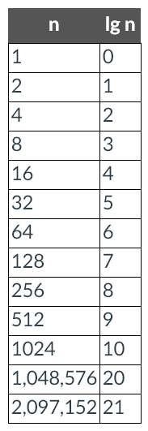
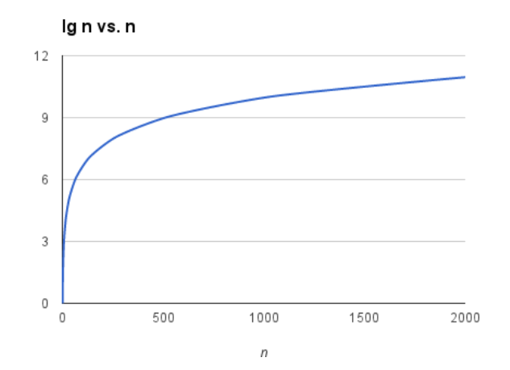
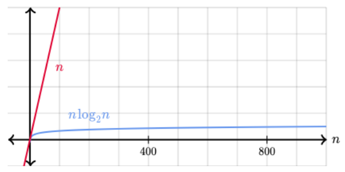

# Week 3

## Overview

The programs we wrote last week were fine for getting started, but they were inherently limited. This week we will extend our skills by learning how to write programs that utilize conditional logic to make decisions. We will also be looking deeper into algorithms.  

### Objectives

By the end of this week, you should be able to:

+ Understand and use boolean operators
+ Apply conditional logic in a Python program

### Readings & Resources

+ All of the readings are in the module for the week. The lectures are interactive, make sure you complete the hands-on exercises inside the lectures.

### Activities & Assignments

+ Complete the Self-Paced activities in PyCharm. Try to do these early in the week, as it will give you time to ask questions.
+ Week 3: Scripting Discussion. Your initial post is DUE WEDNESDAY NIGHT
+ Complete the programming projects

## Lesson

### Flow Control Part I

[Boolean Introduction Video](https://www.youtube.com/watch?v=4XA9CKJJbr4)

#### Boolean Values

+ __Boolean__ data types have only two values `True` and `False`

#### Comparison Operators

+ __Comparison Operators__ evaluate to a single boolean value

|Operator|Meaning|
|--------|-------|
|`==`|`Equal to`|
|`!=`|`Not equal to`|
|`<`|`Less than`|
|`>`|`Greater than`|
|`<=`|`Less than or equal to`|
|`>=`|`Greater than or equal to`|

#### Boolean Operators

+ The three boolean operators are `and`, `or`, and `not`
+ Use them to compare boolean values
+ A truth table shows every possible result of a boolean operator

__and operator__

|Expression|Evaluates to...|
|---|---|
|True and True|True|
|True and False|False|
|False and True|False|
|False and False|False|

__or operator__

|Expression|Evaluates to...|
|---|---|
|True or True|True|
|True or False|True|
|False or True|True|
|False or False|False|

__not operator__

|Expression|Evaluates to...|
|---|---|
|not True|False|
|not False|True|

### Flow Control Part Two

#### Elements of Flow Control

__Conditions__

+ A __condition__ is a more specific name in the context of flow control statements
+ A flow control statement decides what to do based on whether its condition is `True` or `False`

__Blocks of Code__

+ Lines of Python code can be grouped together in __blocks__

1. Blocks begin when the indentation increases.
2. Blocks can contain other blocks.
3. Blocks end when the indentation decreases to zero or to a containing block’s indentation.

__Example of a block__

```python
name = 'Mary'
password = 'swordfish'
if name == 'Mary':
    print('Hello Mary')
    if password == 'swordfish':
        print('Access granted.')
    else:
        print('Wrong password.')
```

#### if Statements

+ `if` statement will execute if statement's condition is `True`

#### else Statements

+ `else` statement can optionally follow an `if` clause

#### elif Statements

+ Only one `if` or `else` clauses will execute, `elif` allows many possible clauses to execute
+ The `elif` statements are executed in order, and once one of them is found to be `True`, the rest of the `elif` clauses are automatically skipped

### Binary Search

+ Let's look a bit closer at the binary search algorithm from the first week
+ Binary search is the fastest algorithm for an already sorted list
+ The technique of cutting the search space in half each time will work for any list of items __as long as that list is already sorted__
+ Binary search is also especially efficient with larger number spaces for searching
+ Simulation Linear vs. Binary search for finding a number in a list [https://www.cs.usfca.edu/~galles/visualization/Search.html](https://www.cs.usfca.edu/~galles/visualization/Search.html)

### Analyzin the Speed of Binary Search

+ Binary search
    + Every time we double the size of the array, we need at most one more guess
    + Suppose we need at most $m$ guesses for an array of length $n$
    + Then, for an array of length $2*n$, the first guess cuts the reasonable portion of the array down to size $n$
    + At most $m$ guesses finish up, giving us a total of at most $m + 1$ guesses

+ We can express the number of guesses, in the worst case, as "the number of times we can repeatedly halve, starting at $n$, until we get the value 1, plus one"
+ Mathematically this is __the base-2 logarithm of n__
+ $log_2 n$
+ Review of logs [https://www.khanacademy.org/math/algebra2/exponential-and-logarithmic-functions/introduction-to-logarithms/v/logarithms](https://www.khanacademy.org/math/algebra2/exponential-and-logarithmic-functions/introduction-to-logarithms/v/logarithms)



Table as chart:


Table as chart zoomed:



+ The logarithm function grows very slowly
+ When n is not a power of 2, we can just go up to the next higher power of 2
+ For an array whose length is 1000, the next higher power of 2 is 1024, which equals $2^10$
    + Therefore, for a 1000-element array, binary search would require at most 11 (10 + 1) guesses
+ Binary search is much faster than linear search (see below)



## Additional Resources

[Conditional Expressions from the Hands on Python Tutorial](http://anh.cs.luc.edu/python/hands-on/3.1/handsonHtml/ifstatements.html)

[Conditional Expressions from python-course.eu](http://www.python-course.eu/python3_conditional_statements.php)


