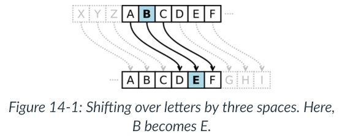

# Week 4

## Overview

In Week 4, we will be exploring two very disparate topics:

+ How to write "loops" in Python. Basically, how do you write a program that repeats a repetitive task multiple times?
+ How characters are implemented in computers. In particular, we will look at two character sets in detail, ASCII and Unicode.

The section on Unicode can get quite dense. Follow along as best as you can. You do not need to become a master of the features of Unicode, but you do need a general sense of how it works.

### Objectives

By the end of this week, you should be able to:

+ Write programs that use While and For loops
+ Understand how the ASCII character set works
+ Have a general sense of how Unicode works as well as the popular UTF-8 encoding
+ Be able to convert from a character to the ASCII value of that character in Python

### Readings & Resources

All of the readings are in Canvas.

### Activities & Assignments

+ Week 4: Help your Neighbor (and Group programming challenge) - Not Graded
+ Week 4: Discussion - Password security and Unicode
+ Week 4: Self-Paced Assignment
+ Week 4: Programming Assignment - Lists
+ Midpoint Course Feedback Survey

## Lesson

### Flow Control - Loops

+ `while` clause will keep looping until condition is met

```python
spam = 0
while spam < 5:
    print('Hello, world.')
    spam = spam + 1
```

```
Hello, world.
Hello, world.
Hello, world.
Hello, world.
Hello, world.
```

#### break Statements

+ If the execution in a `while` loop reaches `break`, it will immediately exit the loop

```python
while True:                         # (1)
    print('Please type your name.')
    name = input()                  # (2)
    if name == 'your name':         # (3)
        break                       # (4)
print('Thank you!')                 # (5)
```

### for Loops and the range() Function

+ `for` loop only loops certain number of times
+ `range(x)` returns the range from 0 up to, but not including, some number, x

```python
print('My name is')
for i in range(5):
    print('Jimmy Five Times (' + str(i) + ')')
```

```
My name is
Jimmy Five Times (0)
Jimmy Five Times (1)
Jimmy Five Times (2)
Jimmy Five Times (3)
Jimmy Five Times (4)
```

+ The `range()` function can also take two numbers such as `range(x1,x2)` and the range will go from `x1` up to, but not including, `x2`

```python
for i in range(12, 16):
    print(i)
```

```
12
13
14
15
```

+ The `range()` function can also take 3 numbers such as `range(x1,x2,step)`. In this case, the range will go from `x1` up to, but not including, `x2`, increasing by increments of `step`

```python
for i in range(0, 10, 2):
    print(i)
```

```
0
2
4
6
8
```

+ `range()` can also count down

```python
for i in range(5, -1, -1):
    print(i)
```

```
5
4
3
2
1
0
```

### Importing Modules

+ Basic functions like `print()`, `input()`, and `len()` are part of Python standard library
+ To use functions in other modules you must import them using `import` statement

```python
import random
for i in range(5):
    print(random.randint(1, 10))
```

```
4
1
8
4
1
```

+ You can also import many modules at once

```python
import random, sys, os, math
```

### Intro to ASCII

+ The American National Standards Institute (ANSI) published an agreement on numbers to represent different characters in computers
+ You can use Python function `ord` to find numerical representation of any simple

```python
>>> ord('*')
42
>>> ord('9')
57
```

+ Each character in ASCII can be represented by 7 bits
+ With 7 bits ASCII can only represent 128 different symbols
+ Therefore, it really only works for English

### UNICODE

+ To address ASCII only working for English the International STandards Organization (ISO) eventually devised a system called __Unicode__
+ It can represent every character in every known language, with room for future growth
+ Because Unicode is somewhat wasteful of space for English documents, ISO also defined several "Unicode Transformaiton Formats" (UTF), the most popular of which is **UTF-8**

[The Absolute Minimum Every Software Developer Absolutely, Positively Must Know About Unicode and Character Sets (No Excuses!)](https://www.joelonsoftware.com/2003/10/08/the-absolute-minimum-every-software-developer-absolutely-positively-must-know-about-unicode-and-character-sets-no-excuses/)

<iframe width="560" height="315" src="https://www.youtube.com/embed/sqPTR_v4qFA" frameborder="0" allow="accelerometer; autoplay; encrypted-media; gyroscope; picture-in-picture" allowfullscreen></iframe>

__UNICODE Domain Phishing Attacks__

[Chrome, Firefox, and Opera users vulnerable to Unicode domain phishing attacks](https://www.grahamcluley.com/chrome-firefox-opera-users-vulnerable-unicode-domain-phishing-attacks/)

### Cryptography

+ The science of writing secret codes is called __cryptography__
+ A secret code system is called a __cipher__
+ In cryptography, the message that we want to be secret is called __plaintext__

For example, the message could be:

`Hello there! The keys to the house are hidden under the flower pot.` 

+ If we convert this plaintext into the encoded message we call it __encrypting__ the plaintext
+ The plaintext is encrypted into the __ciphertext__
+ If you know the cipher used to encrypt the message, you can __decrypt__ the ciphertext back to the plaintext
+ Many ciphers also use __keys__ which are secret values that let you decrypt ciphertext that was encrypted using a specific cipher

For more info in writing cryptography in Python see:

[Hacking Secret Ciphers with Python](http://inventwithpython.com/hacking)

### The Caesar Cipher

+ Key for caesar cipher will be a number form 1 to 26
+ __Caesar Cipher__ was one of the earliest ciphers ever invented
+ In this cipher you encrypt a message by taking each letter (called symbols in cryptography) in the message and replacing it with a "shifted" letter



### ASCII, and Using Numbers for Letters

+ To implement the shifting of these symbols in code, we can represent each letter as a number called an __ordinal__
+ If you use ASCII you can to this easily
+ With ASCII to shift "A" by three spaces, you:
    + Convert “A” to an ordinal (65).
    + Add 3 to 65, to get 68.
    + Convert the ordinal 68 back to a letter (“D”).

### The chr() and ord() Functions

+ The `chr()` function takes an integer ordinal and returns a single-character string
+ The `ord()` function takes a single character string, and returns the integer ordinal value

```python
>>> chr(65)
'A'
>>> ord('A')
65
>>> chr(65+8)
'I'
>>> chr(52)
'4'
>>> chr(ord('F'))
'F'
>>> ord(chr(68))
68
```

### Code for Caesar Cipher in Python

```python
#Caesar Cypher Encryption

#Get the message to encrypt from the user
print('Enter your message:')
unencryptedMessage = input()

#Get the encryption key from the user.  Note the error handling to make sure we have a number from 1-26
key=0
while (key < 1 or key > 26):
    print('Enter the key number (1-26)')
    key = int(input())

print('The key is ' + str(key))

#We will start with an empty string as our encryptedMessage
encryptedMessage = ''

#For each symbol in the unencryptedMessage we will add an encrypted symbol into the encryptedMessage
for symbol in unencryptedMessage:
    if symbol.isalpha():
        num = ord(symbol)
        num += key

        if symbol.isupper():
            if num > ord('Z'):
                num -= 26
            elif num < ord('A'):
                num += 26
        elif symbol.islower():
            if num > ord('z'):
                num -= 26
            elif num < ord('a'):
                num += 26

        encryptedMessage += chr(num)
    else:
        encryptedMessage += symbol

print("Your encrypted message is:")
print(encryptedMessage)
```

__Example Run__:

```
Enter your message:
The wolves are coming!
Enter the key number (1-26)
4
The key is 4
Your encrypted message is:
Xli aspziw evi gsqmrk!
```

### isalpha() String Method

+ `isalpha()` string method will return `True` if the string is an uppercase or lowercase letter form A to Z

```python
>>> 'Hello'.isalpha()
True
>>> 'Forty two'.isalpha()
False
>>> 'Fortytwo'.isalpha()
True
>>> '42'.isalpha()
False
>>> ''.isalpha()
False
```

### isupper() islower() String Methods

+ `isupper()` and `islower()` string methods will return `True` if string contains at least one uppercase letter, or one lowercase letter, respectively

```python
>>> 'HELLO'.isupper()
True
>>> 'hello'.isupper()
False
>>> 'hello'.islower()
True
>>> 'Hello'.islower()
False
>>> 'LOOK OUT BEHIND YOU!'.isupper()
True
>>> '42'.isupper()
False
>>> '42'.islower()
False
>>> ''.isupper()
False
>>> ''.islower()
False
```

### Brute Force

+ Decrypting this message by brute force would only take 26 tries
+ Consider the situation below where each possible key is tried

```
Lwcjba uig vwb jm xtmiaivb, jcb kmzbiqvbg qa ijaczl.

Your translated text is:
1 Kvbiaz thf uva il wslhzhua, iba jlyahpuaf pz hizbyk.
2 Juahzy sge tuz hk vrkgygtz, haz ikxzgotze oy ghyaxj.
3 Itzgyx rfd sty gj uqjfxfsy, gzy hjwyfnsyd nx fgxzwi.
4 Hsyfxw qec rsx fi tpiewerx, fyx givxemrxc mw efwyvh.
5 Grxewv pdb qrw eh sohdvdqw, exw fhuwdlqwb lv devxug.
6 Fqwdvu oca pqv dg rngcucpv, dwv egtvckpva ku cduwtf.
7 Epvcut nbz opu cf qmfbtbou, cvu dfsubjouz jt bctvse.
8 Doubts may not be pleasant, but certainty is absurd.
9 Cntasr lzx mns ad okdzrzms, ats bdqszhmsx hr zartqc.
10 Bmszrq kyw lmr zc njcyqylr, zsr acpryglrw gq yzqspb.
11 Alryqp jxv klq yb mibxpxkq, yrq zboqxfkqv fp xyproa.
12 Zkqxpo iwu jkp xa lhawowjp, xqp yanpwejpu eo wxoqnz.
13 Yjpwon hvt ijo wz kgzvnvio, wpo xzmovdiot dn vwnpmy.
14 Xiovnm gus hin vy jfyumuhn, von wylnuchns cm uvmolx.
15 Whnuml ftr ghm ux iextltgm, unm vxkmtbgmr bl tulnkw.
16 Vgmtlk esq fgl tw hdwsksfl, tml uwjlsaflq ak stkmjv.
17 Uflskj drp efk sv gcvrjrek, slk tvikrzekp zj rsjliu.
18 Tekrji cqo dej ru fbuqiqdj, rkj suhjqydjo yi qrikht.
19 Sdjqih bpn cdi qt eatphpci, qji rtgipxcin xh pqhjgs.
20 Rciphg aom bch ps dzsogobh, pih qsfhowbhm wg opgifr.
21 Qbhogf znl abg or cyrnfnag, ohg pregnvagl vf nofheq.
22 Pagnfe ymk zaf nq bxqmemzf, ngf oqdfmuzfk ue mnegdp.
23 Ozfmed xlj yze mp awpldlye, mfe npceltyej td lmdfco.
24 Nyeldc wki xyd lo zvokckxd, led mobdksxdi sc klcebn.
25 Mxdkcb vjh wxc kn yunjbjwc, kdc lnacjrwch rb jkbdam.
26 Lwcjba uig vwb jm xtmiaivb, jcb kmzbiqvbg qa ijaczl.
```

+ We can see that 8 was probably the correct key because the sentence makes sense

